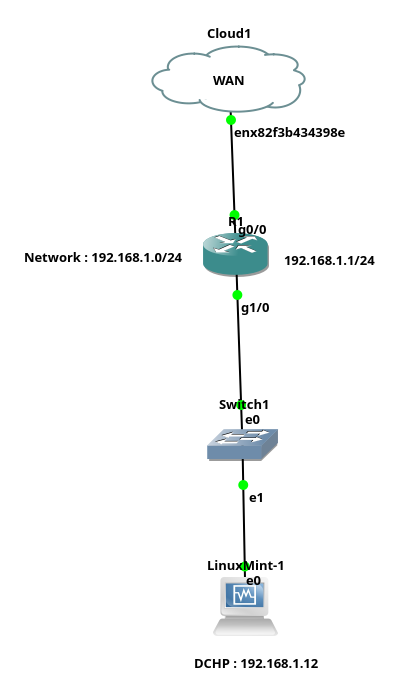
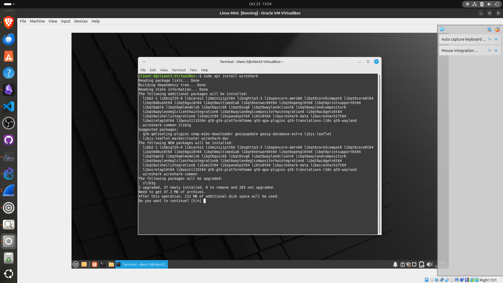
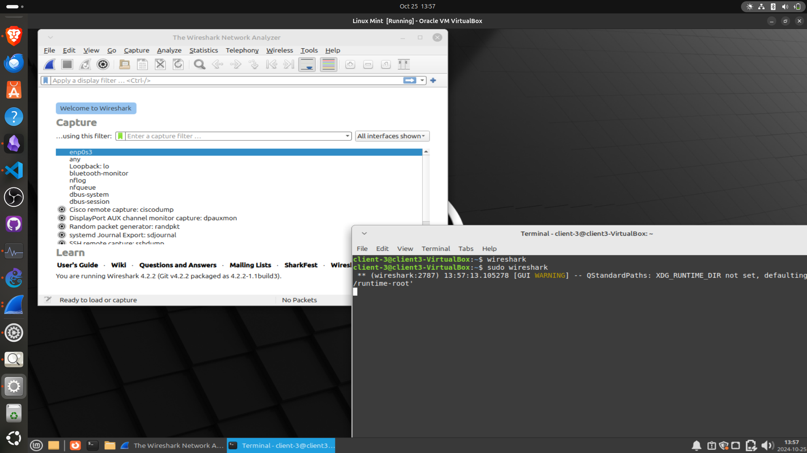
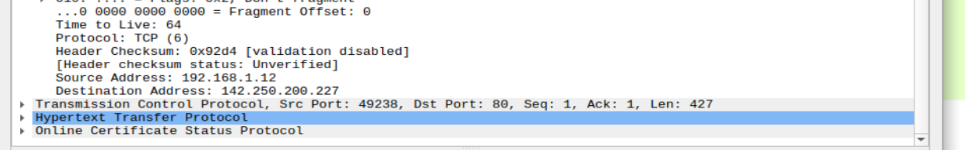
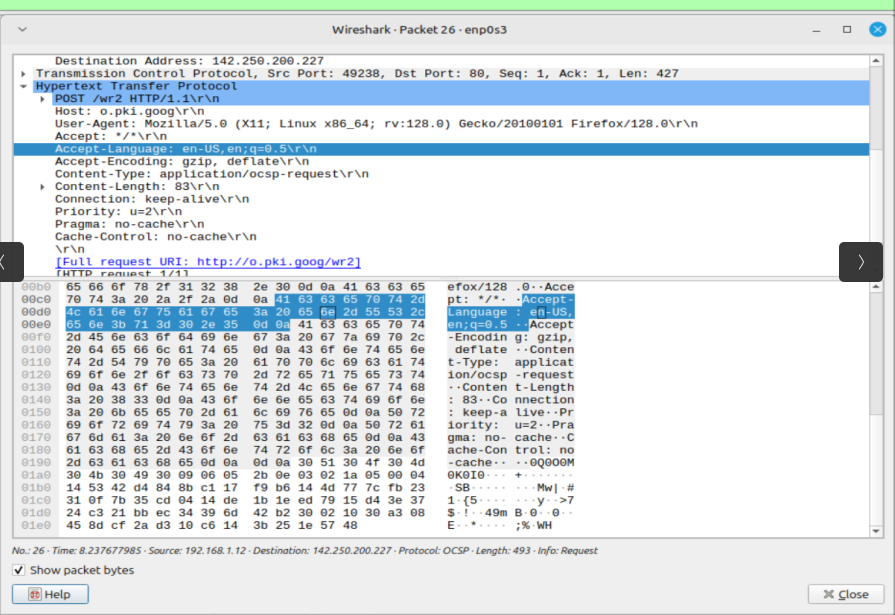
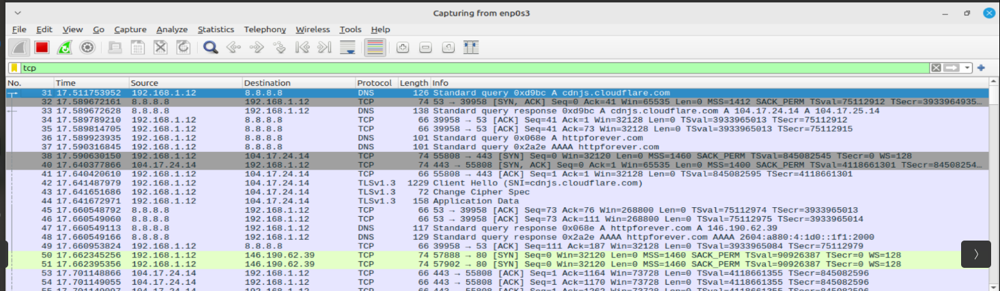
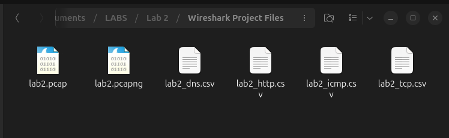

# LAB 0.1: Test Wireshark for Network Traffic Analysis

## **Objective**

To capture, analyze, and understand network traffic using **Wireshark**. This lab will help you familiarize yourself with basic network packet analysis, protocol identification, and network troubleshooting.

---

## **Lab Architecture**

### **Network Components (Inside GNS3)**

1. **Wireshark**
   - The primary tool for capturing and analyzing network traffic.
   - Installed on a device connected to the network.
  
2. **Local Area Network (LAN)**
   - Subnet: **192.168.1.0/24**.
   - Wireshark will monitor this network for traffic capturing.
  
3. **Router/Gateway**
   - A router/gateway connecting the LAN to the internet.
   - This device will act as the main path for internet-bound traffic and can be used for capturing different types of traffic (DNS, HTTP, etc.).
  
4. **PC/Client Devices**
   - A few simulated client devices generating various types of network traffic (web browsing, file transfers, etc.). (Linux Mint Virtual Machine)



---

## **Assignment Tasks**

### 1. **Network Setup**
- Set up a **LAN** environment with at least one client device.
- Install **Wireshark** on the client device or another dedicated system to monitor network traffic.

   I’m using Linux Mint as a client inside my network, so to install Wireshark, I will use:

   ```bash
   sudo apt install wireshark 
   ```

   
  
- Ensure the client device has **internet access** via the router/gateway.

   ```bash
   ping 192.168.1.1
   ping 8.8.8.8
   ```

### 2. **Wireshark Basics**
- Launch Wireshark and select the **network interface** connected to the LAN for traffic capture.

   

- Familiarize yourself with key Wireshark features:
  - **Start Capture**: Begin recording all network traffic.
  - **Stop Capture**: End the traffic recording session.
  - **Filters**: Use simple filters like `http`, `dns`, `tcp`, `icmp` to isolate different traffic types.

   

### 3. **Traffic Capture & Analysis**

#### **Capture Basic Traffic**
Generate network traffic by performing common tasks such as web browsing (HTTP/HTTPS traffic).

I'm using [httpforever.com](http://httpforever.com) to generate HTTP traffic for analysis.


**Wireshark Filter for HTTP:**

```bash
http
```


**Key Observations:**
- **Source IP**: `192.168.1.12` (Client) > **Destination IP**: `146.199.62.39`
  


- **Request Method**: GET and POST
- **User Agent**: Mozilla/5.0



#### **Performing a DNS Lookup**
I used the same website [httpforever.com](http://httpforever.com) to generate traffic.

I set up a filter for `dns` in Wireshark.


I start analyzing traffic with the DNS filter.


- **Source IP**: `192.168.1.128` > **Destination IP**: `8.8.8.8` (my DNS server)


#### **Pinging a Remote IP Address (ICMP Traffic)**
Now let’s try to capture ICMP traffic.

Set up an ICMP filter and try to ping my gateway `192.168.1.1` and `8.8.8.8`.


**Output:**


#### **TCP 3-Way Handshake**
The TCP handshake involves three steps:
1. **SYN**: Client sends a synchronization packet to the server.
2. **SYN-ACK**: The server acknowledges the SYN and responds.
3. **ACK**: The client sends an acknowledgment to establish the connection.



---

### **Wireshark Filters Used**
Wireshark allows you to apply filters to focus on specific types of network traffic:
- **HTTP**: `http`
- **DNS**: `dns`
- **TCP**: `tcp`
- **UDP**: `udp`
- **ICMP (ping)**: `icmp`

### **Deliverables**
- **Wireshark .pcap/.pcapng Files**: Captured traffic data (located in the Wireshark_Project_Files folder)
- **Report**: Summary of the findings and protocol analysis. Available as '[Report.md](http://Report.md)' and 'Report.pdf'
- **CSV Files**: Containing filtered data (HTTP, DNS, TCP, ICMP) located in the Wireshark_Project_Files folder



---

## **Conclusion**
This lab introduced basic network analysis using Wireshark. By capturing and analyzing different network protocols, you gained insights into how data travels across a network, how devices communicate, and how protocols like DNS, TCP, and ICMP function. Wireshark's ability to filter and dissect packets is essential for network troubleshooting, performance optimization, and security analysis.

---

## **Tools Used**
- **GNS3**: For simulating the network environment.
- **Linux Mint**: As the client operating system.
- **Wireshark**: For capturing and analyzing network traffic.
- **Router Model**: Cisco 7200.
- **Client Devices**: Simulated PCs generating network traffic.

