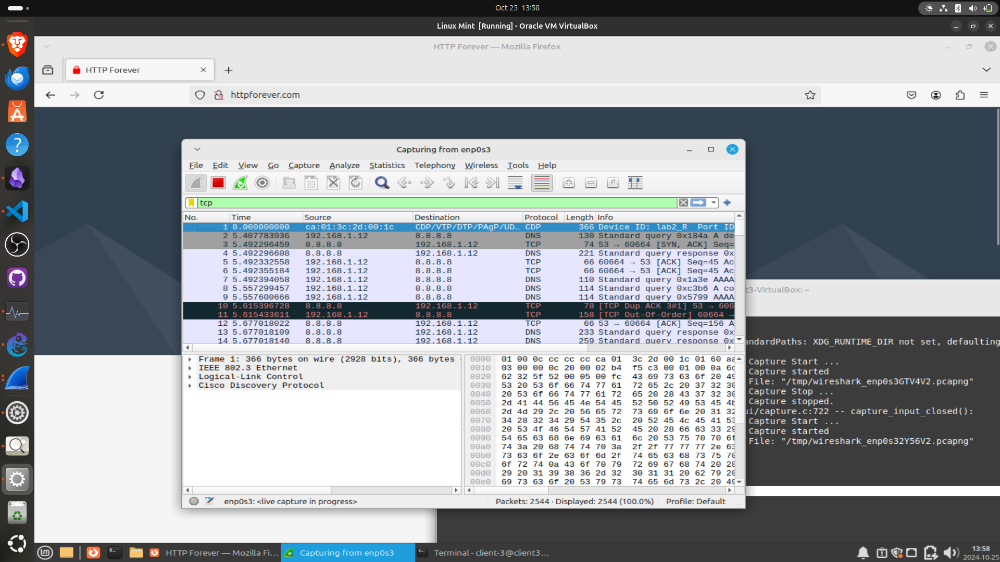
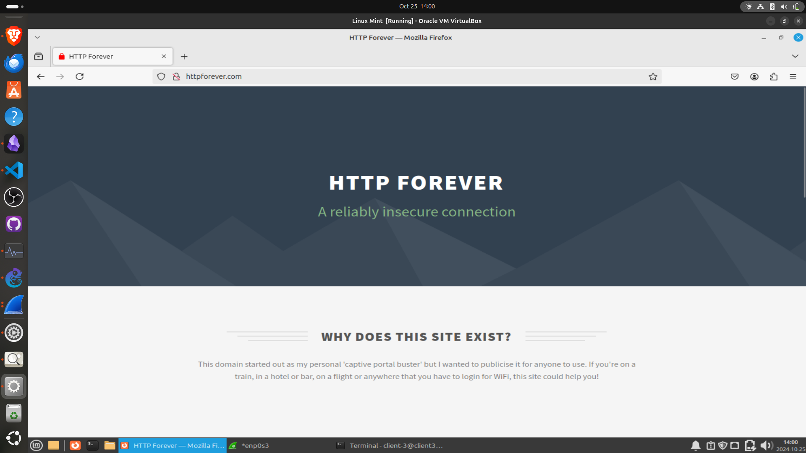
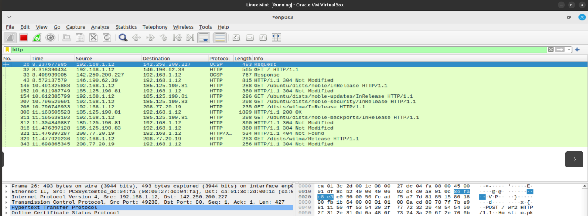
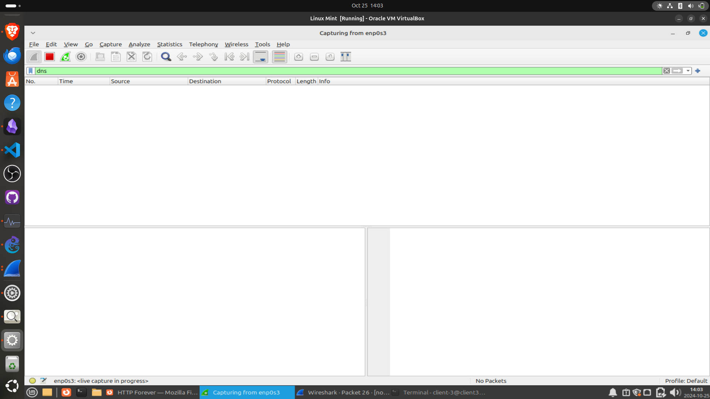
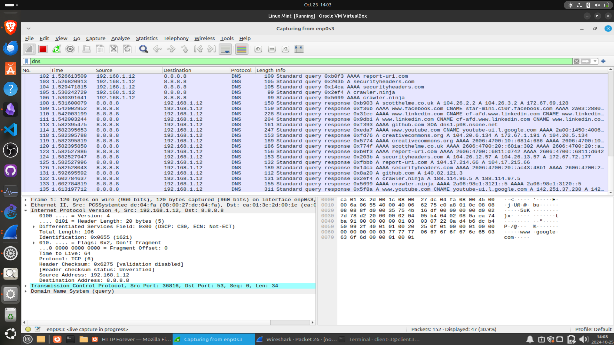
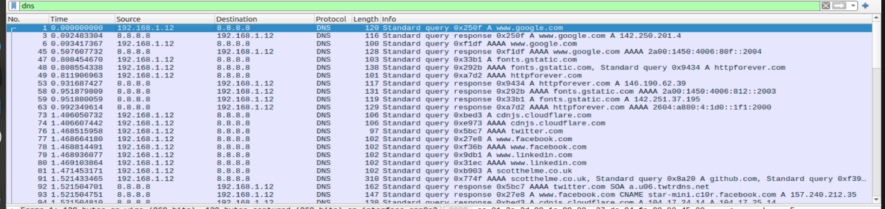
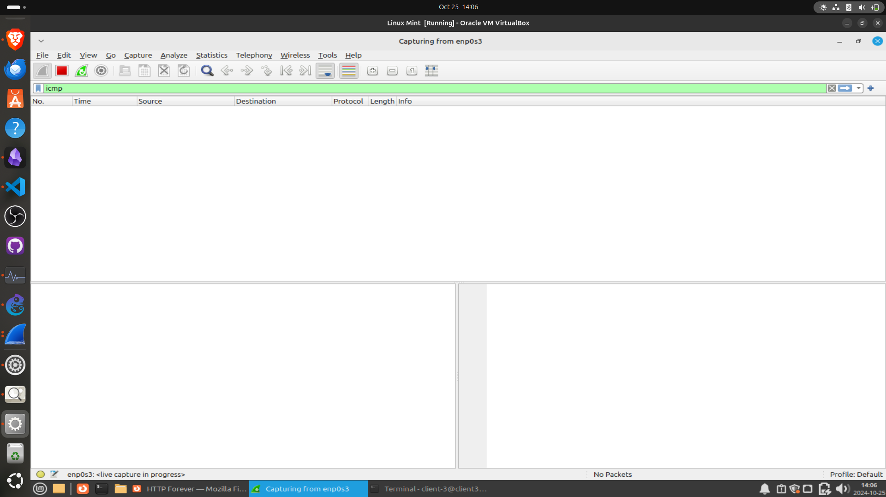
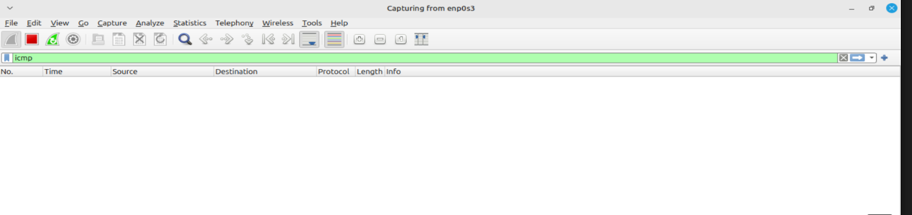
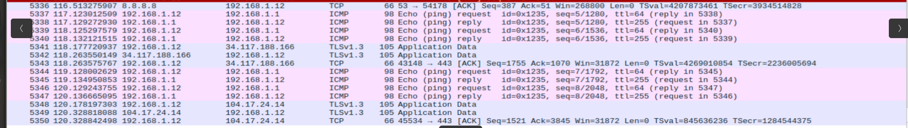

# LAB 2 : Wireshark for Network Traffic Analysis

## **Objective:**

To capture, analyze, and understand network traffic using **Wireshark**. This lab will help you familiarize yourself with basic network packet analysis, protocol identification, and network troubleshooting.

---

### Lab Architecture

### **Network Components (Inside GNS3)**:

1. **Wireshark**:
    - The primary tool for capturing and analyzing network traffic.
    - Installed on a device connected to the network.
2. **Local Area Network (LAN)**:
    - Subnet: **192.168.1.0/24**.
    - Wireshark will monitor this network for traffic capturing.
3. **Router/Gateway**:
    - A router/gateway connecting the LAN to the internet.
    - This device will act as the main path for internet-bound traffic and can be used for capturing different types of traffic (DNS, HTTP, etc.).
4. **PC/Client Devices**:
    - A few simulated client devices generating various types of network traffic (web browsing, file transfers, etc.). ( Linux Mint Virtual Machine )


---

## **Assignment Tasks:**

1. **Network Setup**:
    - Set up a **LAN** environment with at least one client device.
    - Install **Wireshark** on the client device or another dedicated system to monitor network traffic.
    
    I’m using Linux mint as a client inside my Network so to install wireshark I will use :
    
    ```jsx
    sudo apt install wireshark 
    ```
    
    
    
    - Ensure the client device has **internet access** via the router/gateway.
    
    ```jsx
    ping 192.168.1.1
    ping 8.8.8.8
    ```
    
    1. **Wireshark Basics**:
        - Launch Wireshark and select the **network interface** connected to the LAN for traffic capture.
        
        
        
        - Familiarize yourself with key Wireshark features:
            - **Start Capture**: Begin recording all network traffic.
            - **Stop Capture**: End the traffic recording session.
            - **Filters**: Use simple filters like `http`, `dns`, `tcp`, `icmp` to isolate different traffic types.
        
        
        

1. **Traffic Capture & Analysis**:
    
    ### **Capture basic traffic**: Generate network traffic by performing common tasks such as:
    
    ### Web browsing (HTTP/HTTPS traffic).
    
    I'm using [httpforever.com](http://httpforever.com) to generate HTTP traffic for analysis. 
    
    
    
    Wireshark Filter for http : 
    
    ```jsx
    http
    ```
    
    
    
    Key of Observations :
    
    Source IP  `192.168.1.12` (Client) > Destination IP `146.199.62.39`
    
    
    
    Request Method : GET and POST
    
    User Agent : Mozilla/5.0
    
    
    
    ### Performing a DNS lookup (opening a new website).
    
    I used the same website [httpforever.com](http://httpforever.com) as well as other examples to generate traffic.
    
    I set up a filter for `dns` in Wireshark
    
    
    
    I start analyzing Traffic with the dns filter 
    
    
    
    IP Source 192.168.1.128  , Destination IP 8.8.8.8 (my dns server ) 
    
    
    
    ### Pinging a remote IP address (ICMP traffic).
    
    Now let’s try to capture ICMP Traffic 
    
    Setup ICMP filter and try to ping my gateway 192.168.1.1 and also 8.8.8.8
    
    
    
    
    
    Output :
    
    
    
    ### TCP 3-Way handshake
    
    - The TCP handshake involves three steps:
        - **SYN**: Client sends a synchronization packet to the server.
        - **SYN-ACK**: The server acknowledges the SYN and responds.
        - **ACK**: The client sends an acknowledgment to establish the connection.
    
    
    

### **Wireshark Filters I use**

Wireshark allows you to apply filters to focus on specific types of network traffic:

- **HTTP**: `http`
- **DNS**: `dns`
- **TCP**: `tcp`
- **UDP**: `udp`
- **ICMP (ping)**: `icmp`

### **Deliverables**

- **Wireshark .pcap/.pcapng Files**: Captured traffic data (located in the Wireshark_Project_Files folder)
- **Report**: Summary of the findings and protocol analysis. '[Report.md](http://Report.md)' and 'Report.pdf'
- CSV files containing filtered data (HTTP, DNS, TCP, ICMP) located in the Wireshark_Project_Files folder


## **Conclusion**

This lab introduced basic network analysis using Wireshark. By capturing and analyzing different network protocols, you gained insights into how data travels across a network, how devices communicate, and how protocols like DNS, TCP, and ICMP function. Wireshark's ability to filter and dissect packets is essential for network troubleshooting, performance optimization, and security analysis.